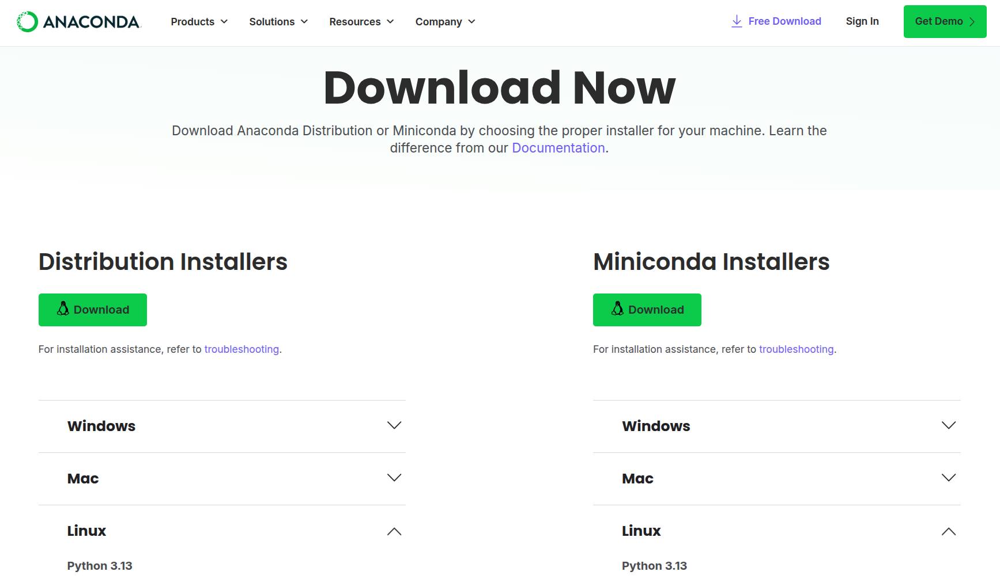
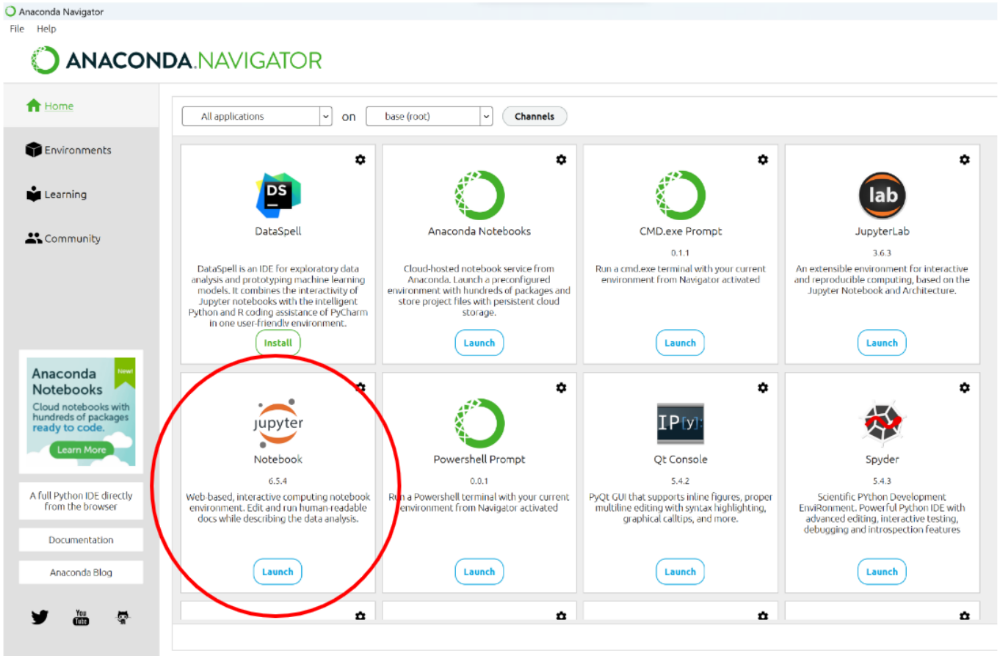

# Introduction to Programming with Python - Anaconda Setup
[David Garcia](http://dgarcia.eu)

To run Python code, we will use Anaconda. The advantage of this platform is that it is straightforward to install, and it comes with a very useful interface called Jupyter Lab. All sessions and assignments will build on this interface.

# Step 1: Download

Visit the Anaconda website, download, and install it with the latest Python version.

# Step 2: Run Navigator

After you have completed the installation, search in your Applications for Anaconda Navigator and start it. In the tab Home, look for Jupyter Notebook and launch it.

# Step 3: Access Notebooks from your browser

If everything worked out, you can now access your own Jupyter Notebooks via your web browser. By default, Anaconda will automatically open a tab with the corresponding page, otherwise, it can be reached in most cases via the link http://localhost:8888

## Additional Information

If you need help with your Anaconda installation, check this video: https://youtu.be/jhFyTv9vLi4

If you prefer using the command line, here are some cheatsheets with handy commands:

- Windows: https://www.cs.columbia.edu/~sedwards/classes/2015/1102-fall/Command%20Prompt%20Cheatsheet.pdf

- Mac: https://github.com/0nn0/terminal-mac-cheatsheet#english-version

